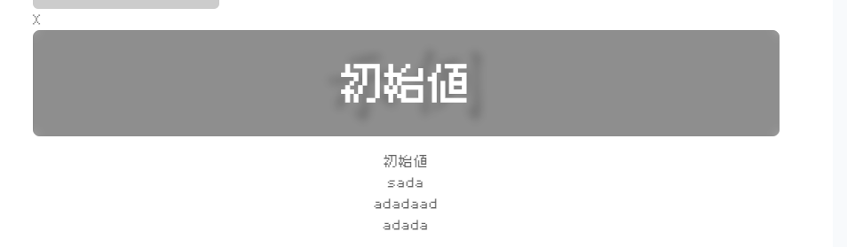
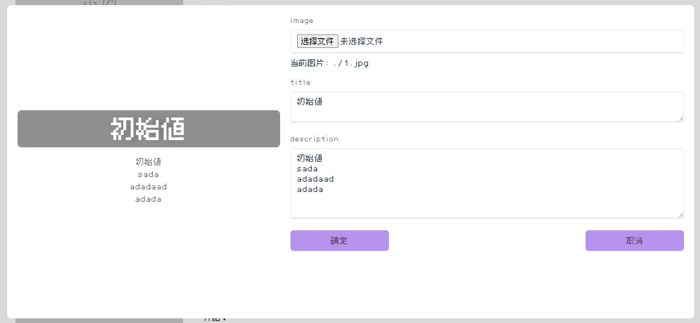
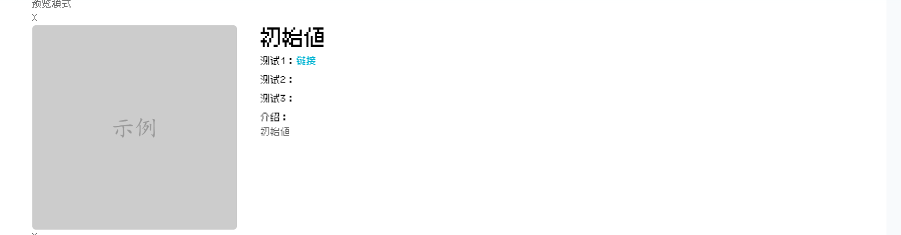
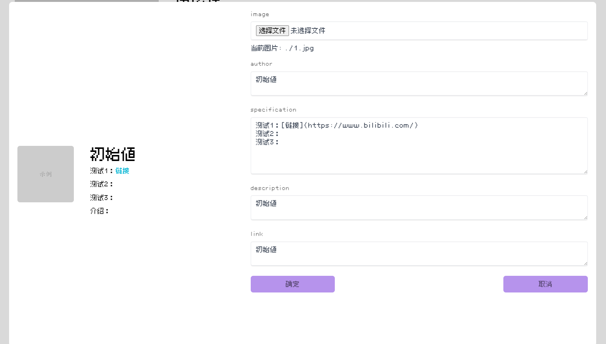
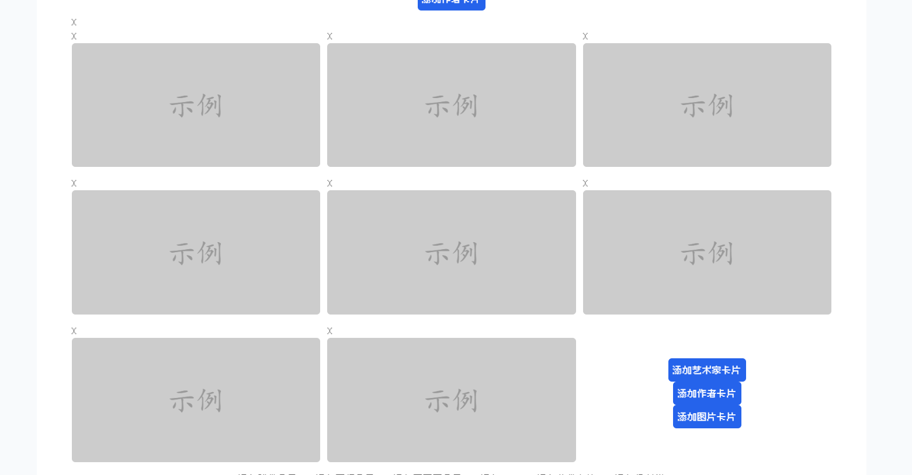
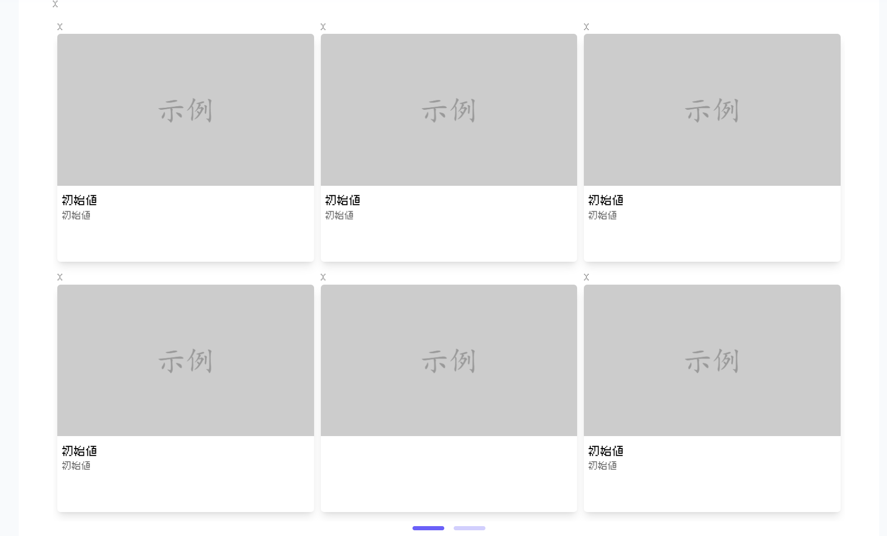
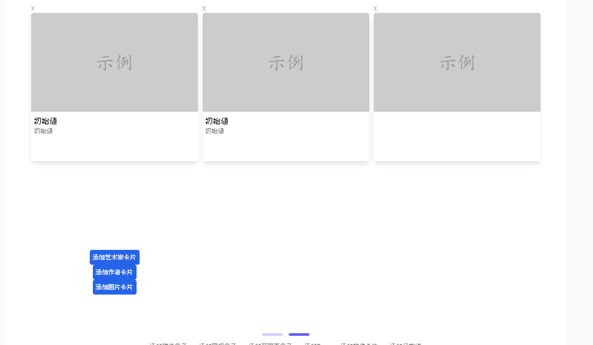

# 准备环境

## 安装Node.js

请到[Node.js官网](https://nodejs.cn/)下载安装包安装Node.js18.18或以上版本。

## 安装npm包管理工具

npm是Node.js的包管理工具，请在命令行中输入以下命令安装npm：

```
npm install -g npm
```

详细的npm安装说明请参考[npm中文文档](https://npm.nodejs.cn/downloading-and-installing-node-js-and-npm)。

## 使用指南

配置好环境后，克隆本仓库，或者下载压缩包，进入项目根目录，执行以下命令安装依赖：

```
npm install
```

然后，启动项目：

```
npm run dev
```

打开浏览器，访问http://localhost:3000，即可看到项目运行效果。
# 编辑指南


## Tag组件


description可接受换行，如果想要换行直接回车即可

## 软件卡片组件



specification可以写一些软件的特性，如语言、操作系统、版本等，换行即可应用新的段落，注意换行一定是输入了回车。可以使用"\[]()"语法添加链接，如"\[GitHub](https://github.com/)"链接中请包含http://或https://。两者颜色的文本是使用中文全角复合"："进行的分割，请勿使用半角冒号":"。

link中填写的链接是应用在标题和图片中，link可为空。

## 三种容器盒子（网格盒子，弹性盒子，可翻页盒子）
### 网格盒子

可以无限向下扩展，排列方式如图所示
### 弹性盒子

可以根据内容自动调整大小，目前只用于放置作者卡片，排列方式如图所示
### 可翻页盒子


每页的上限是6个，可以自动分页，排列方式如图所示，鼠标滚轮在上面滚动可以翻页，也可以点击下方按钮翻页